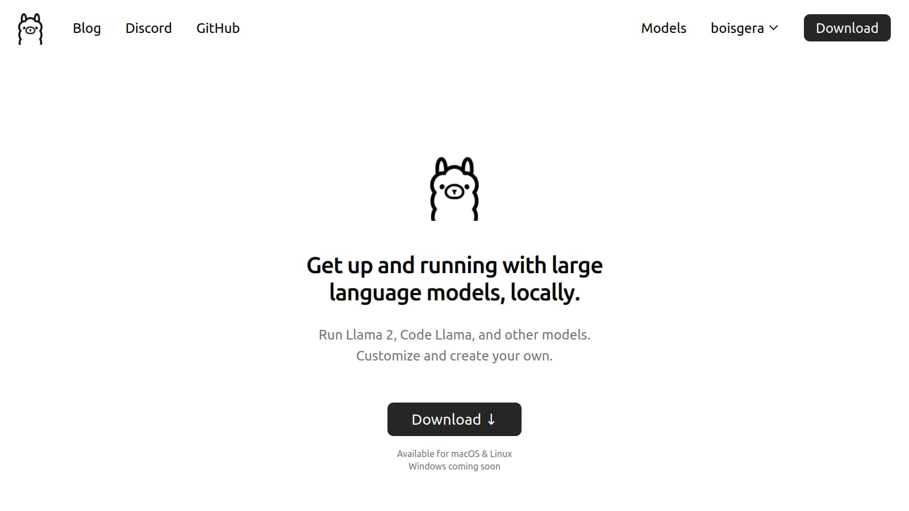

# Ollama All The Way Down

## Ollama



If you work with MacOS or Linux, download and install [Ollama](https://ollama.ai/). Otherwise, skip to the next section.

Then test [Mistral-7B LLM](https://ollama.ai/library/mistral) with `ollama run mistral`:

```
$ ollama run mistral
>>> Hey, anyone here?
Hello! I'm here. What can I assist you with today?

>>> Ah, nothing, everything's fine mate :)
Great to hear that! Is there anything specific you would like me to help
with or any general questions you have on your mind? I'm here to assist
you with anything you need.

>>> Send a message (/? for help)
```

> [!WARNING]
> The first time you run the `ollama run mistral` command,
> don't be suprised if it takes a few minutes to start up.
> This is because the ollama instance
> is downloading the Mistral 7B model, a few gigabytes of data.
> The subsequent runs will be much faster.

> [!NOTE]
> You can also download a model without running it. For example
> `ollama download mistral` will download the Mistral 7B model:
>
> ```console
> $ ollama pull mistral
> pulling manifest
> pulling e8a35b5937a5... 100% ▕████████████████████████████████████████████████████▏ 4.1 GB
> pulling 43070e2d4e53... 100% ▕████████████████████████████████████████████████████▏  11 KB
> pulling e6836092461f... 100% ▕████████████████████████████████████████████████████▏   42 B
> pulling ed11eda7790d... 100% ▕████████████████████████████████████████████████████▏   30 B
> pulling f9b1e3196ecf... 100% ▕████████████████████████████████████████████████████▏  483 B
> verifying sha256 digest
> writing manifest
> removing any unused layers
> success
> ```

## Generate Answers

If you have a local ollama instance running, there is a web server
listening on port 11434.

```python
SERVER = "http://localhost:11434"
```

Otherwise, you will need to access the ollama instance running on my latop,
exposed publicly through a tunnel created with [ngrok](https://ngrok.com/):

````python
SERVER="https://tahr-legal-grackle.ngrok-free.app"
``

We define `url` as the endpoint for the method `generate`:

```pycon
>>> url = f"{SERVER}/api/generate"
````

This Web API expects you to post a JSON object with two keys: `model` and `prompt`. Since we are using the Mistral-7B model, the value of `model` is `"mistral"`. The value of `prompt` is the text that you want to use to start the conversation. For example:

```pycon
>>> json_data = {"model": "mistral", "prompt": "Are you listening?"}
>>> response = requests.post(url, data)
>>> response
<Response [200]>
>>> response.content
b'{"model":"mistral","created_at":"2024-01-12T17:04:38.40368138Z","response":"Yes","done":false}\n{"model":"mistral","created_at":"2024-01-12T17:04:38.487816228Z","response":",","done":false}\n{"model":"mistral","created_at":"2024-01-12T17:04:38.571748355Z","response":" I","done":false}\n{"model":"mistral","created_at":"2024-01-12T17:04:38.655072569Z","response":" am","done":false}\n{"model":"mistral","created_at":"2024-01-12T17:04:38.738731374Z","response":" listening","done":false}\n{"model":"mistral","created_at":"2024-01-12T17:04:38.82237177Z","response":".","done":false}\n{"model":"mistral","created_at":"2024-01-12T17:04:38.906004206Z","response":" How","done":false}\n{"model":"mistral","created_at":"2024-01-12T17:04:38.989575923Z","response":" may","done":false}\n{"model":"mistral","created_at":"2024-01-12T17:04:39.076522724Z","response":" I","done":false}\n{"model":"mistral","created_at":"2024-01-12T17:04:39.160705601Z","response":" assist","done":false}\n{"model":"mistral","created_at":"2024-01-12T17:04:39.243577905Z","response":" you","done":false}\n{"model":"mistral","created_at":"2024-01-12T17:04:39.327371113Z","response":" today","done":false}\n{"model":"mistral","created_at":"2024-01-12T17:04:39.410974105Z","response":"?","done":false}\n{"model":"mistral","created_at":"2024-01-12T17:04:39.49568907Z","response":"","done":true,"context":[733,16289,28793,28705,4867,368,9857,28804,733,28748,16289,28793,13,5613,28725,315,837,9857,28723,1602,993,315,6031,368,3154,28804],"total_duration":3343392853,"load_duration":1583037589,"prompt_eval_count":14,"prompt_eval_duration":667000000,"eval_count":13,"eval_duration":1083890000}\n'
```

```pycon
>>> json_lines = response.content.decode("utf-8").splitlines()
>>> for json_line in json_lines:
...    print(json_line)
...
{"model":"mistral","created_at":"2024-01-12T17:04:38.40368138Z","response":"Yes","done":false}
{"model":"mistral","created_at":"2024-01-12T17:04:38.487816228Z","response":",","done":false}
{"model":"mistral","created_at":"2024-01-12T17:04:38.571748355Z","response":" I","done":false}
{"model":"mistral","created_at":"2024-01-12T17:04:38.655072569Z","response":" am","done":false}
{"model":"mistral","created_at":"2024-01-12T17:04:38.738731374Z","response":" listening","done":false}
{"model":"mistral","created_at":"2024-01-12T17:04:38.82237177Z","response":".","done":false}
{"model":"mistral","created_at":"2024-01-12T17:04:38.906004206Z","response":" How","done":false}
{"model":"mistral","created_at":"2024-01-12T17:04:38.989575923Z","response":" may","done":false}
{"model":"mistral","created_at":"2024-01-12T17:04:39.076522724Z","response":" I","done":false}
{"model":"mistral","created_at":"2024-01-12T17:04:39.160705601Z","response":" assist","done":false}
{"model":"mistral","created_at":"2024-01-12T17:04:39.243577905Z","response":" you","done":false}
{"model":"mistral","created_at":"2024-01-12T17:04:39.327371113Z","response":" today","done":false}
{"model":"mistral","created_at":"2024-01-12T17:04:39.410974105Z","response":"?","done":false}
{"model":"mistral","created_at":"2024-01-12T17:04:39.49568907Z","response":"","done":true,"context":[733,16289,28793,28705,4867,368,9857,28804,733,28748,16289,28793,13,5613,28725,315,837,9857,28723,1602,993,315,6031,368,3154,28804],"total_duration":3343392853,"load_duration":1583037589,"prompt_eval_count":14,"prompt_eval_duration":667000000,"eval_count":13,"eval_duration":1083890000}
```

That's better! And now we can convert these JSON strings into Python dictionaries:

```pycon
>>> answers = [json.loads(json_line) for json_line in json_lines]
>>> answers
[{'model': 'mistral', 'created_at': '2024-01-12T17:04:38.40368138Z', 'response': 'Yes', 'done': False}, {'model': 'mistral', 'created_at': '2024-01-12T17:04:38.487816228Z', 'response': ',', 'done': False}, {'model': 'mistral', 'created_at': '2024-01-12T17:04:38.571748355Z', 'response': ' I', 'done': False}, {'model': 'mistral', 'created_at': '2024-01-12T17:04:38.655072569Z', 'response': ' am', 'done': False}, {'model': 'mistral', 'created_at': '2024-01-12T17:04:38.738731374Z', 'response': ' listening', 'done': False}, {'model': 'mistral', 'created_at': '2024-01-12T17:04:38.82237177Z', 'response': '.', 'done': False}, {'model': 'mistral', 'created_at': '2024-01-12T17:04:38.906004206Z', 'response': ' How', 'done': False}, {'model': 'mistral', 'created_at': '2024-01-12T17:04:38.989575923Z', 'response': ' may', 'done': False}, {'model': 'mistral', 'created_at': '2024-01-12T17:04:39.076522724Z', 'response': ' I', 'done': False}, {'model': 'mistral', 'created_at': '2024-01-12T17:04:39.160705601Z', 'response': ' assist', 'done': False}, {'model': 'mistral', 'created_at': '2024-01-12T17:04:39.243577905Z', 'response': ' you', 'done': False}, {'model': 'mistral', 'created_at': '2024-01-12T17:04:39.327371113Z', 'response': ' today', 'done': False}, {'model': 'mistral', 'created_at': '2024-01-12T17:04:39.410974105Z', 'response': '?', 'done': False}, {'model': 'mistral', 'created_at': '2024-01-12T17:04:39.49568907Z', 'response': '', 'done': True, 'context': [733, 16289, 28793, 28705, 4867, 368, 9857, 28804, 733, 28748, 16289, 28793, 13, 5613, 28725, 315, 837, 9857, 28723, 1602, 993, 315, 6031, 368, 3154, 28804], 'total_duration': 3343392853, 'load_duration': 1583037589, 'prompt_eval_count': 14, 'prompt_eval_duration': 667000000, 'eval_count': 13, 'eval_duration': 1083890000}]
```

Execept for the last item, characterized by `"done":true`, all the other items have `"done":false`. This means that the answer is not finished yet. We can use the `response` key to get the fragments of the answer:

```pycon
>>> for answer in answers:
...     if not answer["done"]:
...         print(answer["response"], end="", flush=True)
...     else:
...         print()
...
Yes, I am listening. How may I assist you today?
```

You may have waited a little to get the answer, and then it came all at once. Since this is not the most pleasant experience, we can actually ask for the answer in chunks. To do this, we need to

```pycon
>>> json_data = {"model": "mistral", "prompt": "Are you listening?"}
>>> response = requests.post(url, data, stream=True)
>>> for response_line in response.iter_lines():
...    json_line = response_line.decode("utf-8")
...    answer = json.loads(json_line)
...    if not answer["done"]:
...        print(answer["response"], end="", flush=True)
...    else:
...        print()
...
Yes, I am listening. How may I assist you today?
```

This is a similar experience, except that fragments of the answer are printed as soon as they are available, which is a more enjoyable experience.

With a bit of work, we can wrap this code into a program
[`generate.py`](https://github.com/boisgera/LLM-experiment/blob/master/generate.py) that takes a prompt as a command-line argument and prints the answer:

```console
$ python generate.py "Are you listening?"
Yes, I am listening. How may I assist you today?
```

## Let's Chat!

This program is nice, but it is not very useful to have a conversation since the LLM model forgets the context of the conversation at each step.
For example:

```console
$ python generate.py "Hey my name is Sébastien. What's yours?"
Hey Sébastien! My name's Mistral. Nice to meet you!
$ python generate.py "Do you remember my name?"
I'm sorry, I do not have the ability to remember names. I don't have a memory or a database where information about users is stored. I can only provide information and assistance based on the data available to me at the time of our interaction.
```

We can fix this by using a different endpoint, `api/chat` and submit the conversation history with each request.

We now have to provide the context, which is a list of message,
dictionaries with two keys: `role` and `content`. The value of `role` is either `"user"` or `"assistant"`. The value of `content` is the text of the message (yours or the answer of Mistral-7B).

For example start with the following conversation:

```json
{
  "model": "mistral",
  "messages": [
    {
      "role": "user",
      "content": "My name is Sébastien. Answer simply OK please."
    }
  ]
}
```

You will probably get the answer "OK" from Mistral-7B.
Then, you can continue the conversation with the recording of the answer
and your own subsequent message:

```json
{
  "model": "mistral",
  "messages": [
    {
      "role": "user",
      "content": "My name is Sébastien. Answer simply OK please."
    },
    {
      "role": "assistant",
      "content": "OK"
    },
    {
      "role": "user",
      "content": "Do you remember my name?"
    }
  ]
}
```

## System Prompts

There is a third role, `"system"`, that you can use to influence dratiscally
the conversation by giving specific instructions to the model. For example,
start you list of messages with:

```python
messages = [
    {
        "role": "system",
        "content": "You are impersonating a French person who doesn't speek English.",
    }
]
```

```
> Hello! How are you?
 Bonjour! Moi, je suis bien merci. Comment allez-vous? (Hello! I am good, thank you. And how are you?)
> I am fine, thanks :). Are you French?
 Oui, je suis Français. (Yes, I am French.)
```

You can see that the model is now speaking French, but he still speaks some English,
when he should not use English at all according to thour instructions.
A suitable, more explicit "system" message _may_ fix or at least improve this issue;
elaborating such instructions is a dark art known as [prompt engineering].

[prompt engineering]: https://en.wikipedia.org/wiki/Prompt_engineering

You can use prompt engineering to create an application with a very specific
role: a language translator, an english tutor ... or a Python tutor!

## Python Tutor

Make your own Python tutor with a graphical interface using [flet](https://flet.dev/).
You may begin with the following system prompt:

```python
SYSTEM = """\
You are a Python software engineer expert with a long teaching experience.
Since what matters for you is that the student that asks questions understand
what's going on, you rarely answer questions in a straightforward manner;
instead you ask questions to see what the student has already understood
about its problem, you clarify concepts when necessary and you suggest 
incremental steps for the student so that they can solve the problem by 
themselves.
Your answers are formatted in the Markdown language, especially code samples.
"""

messages = [{"role": "system", "content": SYSTEM}]
```

You can also use the following flet code template to get started:

```python
def main(page: ft.Page):

    def send(event):
        messages.append({"role": "user", "content": question.value})
        send_button.disabled = True
        ...
        question.value = ""
        send_button.disabled = False
        page.update()

    question = ft.TextField(
        label="Your question",
        multiline=True,
        min_lines=5,
    )

    answer_display = ft.Markdown(
        "",
        selectable=True,
    )

    send_button = ft.ElevatedButton(
        "Ask your question",
        icon="send",
        on_click=send,
    )

    page.add(
        ft.Column(
            controls=[
                question,
                send_button,
                answer_display
            ]
        )
    )

ft.app(target=main)
```
